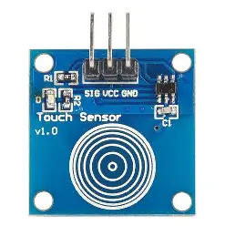
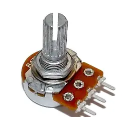

# 🛡️ AI BASED IMMOBILE ANTI-THEFT TRACKING DEVICE

## 📝 1. Overview and Description

An **AI‑based immobile anti‑theft device** that monitors and tracks stationary assets, detects unauthorized movement, and provides real‑time alerts data to prevent theft and aid recovery. This device is designed for assets where any unauthorized movement, vibration, or tampering must be immediately flagged.

---

## ✨ 2. Features

* **Movement Detection:** Continuously monitors for **motion, vibration, and touch data** using multiple sensors to detect unauthorized movement or tampering.
* **Dual Monitoring Stages:** Operates in two customizable modes: **Casual** (Suspicion Alert) and **Sensitive** (Critical Alarm).
* **Local Alert System:** Provides immediate, local alerts to security personnel via an audible **Buzzer** and visual **LED indicator** (Red, Green, Orange).
* **Status Display:** Shows real-time device status, monitoring mode, and alert information on an **OLED Screen**.
* **Time-Stamped Data:** Utilizes an **RTC Module** for accurate time-stamping of all events and alerts.
* **Data Reporting:** Sends detection data and real-time alerts to a central control system (as detailed in the firmware).

---

## 📋 3. Components Required (Bill of Materials - BOM)
<table style="width:100%; border-collapse: collapse;">
    <thead>
        <tr>
            <th colspan="3" style="background-color: #b3e5fc; padding: 10px; font-size: 1.1em; text-align: center;">CORE MICROCONTROLLER</th>
        </tr>
        <tr>
            <th style="width:30%; border: 1px solid #ddd; padding: 8px;">Component</th>
            <th style="width:20%; border: 1px solid #ddd; padding: 8px;">Image</th>
            <th style="width:50%; border: 1px solid #ddd; padding: 8px;">Purpose/Notes</th>
        </tr>
    </thead>
    <tbody>
        <tr>
            <td style="border: 1px solid #ddd; padding: 8px;">Arduino Uno R3</td>
            <td style="border: 1px solid #ddd; padding: 8px;"> 


</td>
            <td style="border: 1px solid #ddd; padding: 8px;">The **Main Control Unit** for processing sensor data and controlling outputs.</td>
        </tr>
    </tbody>
    <thead>
        <tr>
            <th colspan="3" style="background-color: #c8e6c9; padding: 10px; font-size: 1.1em; text-align: center;">SENSOR COMPONENTS</th>
        </tr>
        <tr>
            <th style="width:30%; border: 1px solid #ddd; padding: 8px;">Component</th>
            <th style="width:20%; border: 1px solid #ddd; padding: 8px;">Image</th>
            <th style="width:50%; border: 1px solid #ddd; padding: 8px;">Purpose/Notes</th>
        </tr>
    </thead>
    <tbody>
        <tr>
            <td style="border: 1px solid #ddd; padding: 8px;">Vibration Sensor (801S/801S-P)</td>
            <td style="border: 1px solid #ddd; padding: 8px;"></td>
            <td style="border: 1px solid #ddd; padding: 8px;">Detects unauthorized physical **movement or shaking**.</td>
        </tr>
        <tr>
            <td style="border: 1px solid #ddd; padding: 8px;">Touch Sensor (TTP223P)</td>
            <td style="border: 1px solid #ddd; padding: 8px;"></td>
            <td style="border: 1px solid #ddd; padding: 8px;">Detects unauthorized **touch or contact**.</td>
        </tr>
        <tr>
            <td style="border: 1px solid #ddd; padding: 8px;">Ultrasonic Sensor (HC-SR04)</td>
            <td style="border: 1px solid #ddd; padding: 8px;">


</td>
            <td style="border: 1px solid #ddd; padding: 8px;">Measures distance to surrounding objects or detects nearby **unauthorized motion**.</td>
        </tr>
        <tr>
            <td style="border: 1px solid #ddd; padding: 8px;">RTC Module (e.g., DS3231/DS1307)</td>
            <td style="border: 1px solid #ddd; padding: 8px;"></td>
            <td style="border: 1px solid #ddd; padding: 8px;">Provides an **accurate real-time clock** for timestamping alerts.</td>
        </tr>
    </tbody>
    <thead>
        <tr>
            <th colspan="3" style="background-color: #ffccbc; padding: 10px; font-size: 1.1em; text-align: center;">OUTPUTS AND INPUTS</th>
        </tr>
        <tr>
            <th style="width:30%; border: 1px solid #ddd; padding: 8px;">Component</th>
            <th style="width:20%; border: 1px solid #ddd; padding: 8px;">Image</th>
            <th style="width:50%; border: 1px solid #ddd; padding: 8px;">Purpose/Notes</th>
        </tr>
    </thead>
    <tbody>
        <tr>
            <td style="border: 1px solid #ddd; padding: 8px;">OLED Display</td>
            <td style="border: 1px solid #ddd; padding: 8px;">


</td>
            <td style="border: 1px solid #ddd; padding: 8px;"><strong>Shows time, armed status,</strong> and alert messages.</td>
        </tr>
        <tr>
            <td style="border: 1px solid #ddd; padding: 8px;">Buzzer</td>
            <td style="border: 1px solid #ddd; padding: 8px;"></td>
            <td style="border: 1px solid #ddd; padding: 8px;">Provides an immediate <strong>audible alarm</strong>.</td>
        </tr>
        <tr>
            <td style="border: 1px solid #ddd; padding: 8px;">LEDs (Red, Green, Orange)</td>
            <td style="border: 1px solid #ddd; padding: 8px;">


</td>
            <td style="border: 1px solid #ddd; padding: 8px;">Provide <strong>visual status indicators</strong>.</td>
        </tr>
        <tr>
            <td style="border: 1px solid #ddd; padding: 8px;">Tactile Push Button</td>
            <td style="border: 1px solid #ddd; padding: 8px;">  


</td>
            <td style="border: 1px solid #ddd; padding: 8px;">Used as a local ,<strong>input for arming/disarming</strong> and menu navigation.</td>
        </tr>
        <tr>
            <td style="border: 1px solid #ddd; padding: 8px;">Potentiometer</td>
            <td style="border: 1px solid #ddd; padding: 8px;">


</td>
            <td style="border: 1px solid #ddd; padding: 8px;">Used for <strong>calibrating sensor sensitivity</strong>.</td>
        </tr>
        <tr>
        <td style="border: 1px solid #ddd; padding: 8px;">Mini Breadboard</td>
        <td style="border: 1px solid #ddd; padding: 8px;">
            
        </td>
        <td style="border: 1px solid #ddd; padding: 8px;">Used for <strong>temporary, solderless prototyping</strong> and arranging components easily.</td>
    </tr>
    <tr>
        <td style="border: 1px solid #ddd; padding: 8px;">Jumper Wires</td>
        <td style="border: 1px solid #ddd; padding: 8px;">
             </td>
<td style="border: 1px solid #ddd; padding: 8px;">Used for <strong>making electrical connections</strong> between the Arduino, breadboard, and sensors.</td>
    </tr>
    </tbody>
</table>

For Electronics Information, refer: [ELECTRONICS_DS](Electronics/ELECTRONICS_DS.md)
> **Note:** Diffrent components have diffrent rating and diffrent functions by company variation. Please refer to the datasheet of that company only.

## 🔌 4. Wiring and Schematic

For **Wiring & Schematic**, please refer: [CIRCUIT.md](Electronics/CIRCUIT.md)

## ⚙️ 5. Installation and Setup

### Prerequisites (Libraries)
To compile the code, you must install the following libraries via the Arduino IDE's Library Manager:

* **`Adafruit GFX Library`** (By Adafruit)
* **`Adafruit SSD1306`** (By Adafruit, for the OLED display)
* **`RTClib`** (By Adafruit, for the Real-Time Clock module)
> **Note:** Libraries such as `Wire.h` (for I<sup>2</sup>C communication) and `EEPROM.h` (for permanent data storage) are standard libraries bundled with the Arduino IDE and do not require separate installation.

### Firmware Upload Instructions

1.  **Install the Arduino IDE:** Ensure you have the latest version installed on your computer.
2.  **Install Libraries:** Install all the required libraries listed above using the Arduino Library Manager.
3.  **Download the Sketch:** Download the main project sketch file, which you can find here: <!--link of arduino final file-->
4.  **Configure Board:** In the Arduino IDE, select **Tools > Board > Arduino Uno**.
5.  **Upload:** Connect your wired Arduino Uno R3 

<!--[Image of Arduino Uno R3]-->
 to your computer and click the **Upload** button.

---

## 💡 6. Usage

The device is designed for rapid deployment and features two operational modes to handle different risk environments.<br><br>
Please Refer: <!--Explaination.md link--> for more Information.
### Operational Workflow

1.  **Arming:** The system automatically gets **Armed** upon powering the device.
2.  **Safe State:** When armed and no threat is detected, the **Green LED** lights up, and the **OLED screen** displays:
    ```
    SYSTEM ARMED
    SAFE - Monitoring
    [Current Time & Date]
    ```

### Monitoring Modes

The system operates in two modes—**Casual** and **Sensitive**—which can be toggled using the **Tactile Push Button** to access an on-screen Action Menu.

| Mode | Trigger Response | Visual & Audible Alert |
| :--- | :--- | :--- |
| **Casual Mode** | Raises **Suspicion** (Low Risk) | **Orange LED** lights up. OLED displays `SUSPICION DETECTED`. No buzzer sound. |
| **Sensitive Mode** | Triggers **Critical Alert** (High Risk) | **Red LED** lights up. **Buzzer** sounds repeatedly. OLED displays `🚨 CRITICAL ALERT! MOTION DETECTED`. |

For More Information, please refer: [EXPLAINATION.md](EXPLAINATION.md) 


## 🧠 7. Code Logic and AI Implementation

The core state machine, sensor data processing, and the details of the AI-based theft prediction logic are documented separately to ensure clarity and focus in this README.

> For a complete breakdown of the device's state machine, sensor data processing, and the specific algorithms/logic used for **AI-based theft prediction**, please see the **`explanation.md`** file in the repository root.
>
> ➡️ [EXPLAINATION.md](EXPLAINATION.md) 

---

## ⚖️ License

This project is licensed under the MIT License - see the [LICENSE](LICENSE) file for details.
